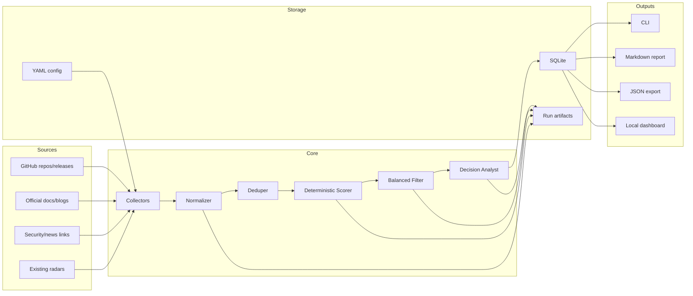

# Agent/Tooling Adoption Radar Design

**Date:** 2026-06-10  
**Project:** On-Prem AI Adoption Radar  
**V1 scope:** Agent/tooling technologies only  
**Target user:** An agent/platform engineer who needs to decide what to try, demo, adopt, or ignore in the fast-moving AI tooling ecosystem.

## 1. Purpose

The project is not a generic AI news digest. Existing open-source projects such as Horizon, agents-radar, OpenClaw Academic Radar, ArxivDigest, Folo, RSSHub, and n8n news templates already cover broad collection, summarization, and feed delivery.

This V1 adds a narrower decision layer:

> Given new activity around AI agents and tooling, decide whether it is useful for personal workflow, company demos, on-prem enterprise consulting, or security watch.

The first version focuses on technologies that can improve the user's current workflow now: coding agents, general-purpose agents, MCP tooling, agent frameworks, and sandbox/security systems.

## 2. Product Thesis

Most radars answer "what happened?" This radar answers "what should I do with it?"

Each item becomes a decision card with a ring:

- **Adopt:** useful now with manageable risk.
- **Pilot:** try this week on a contained task.
- **Watch:** important but immature, unclear, or not yet worth hands-on time.
- **Avoid:** unsafe, abandoned, duplicated, or too expensive to evaluate.

The radar should reduce overwhelm by producing a small weekly queue:

- Try these 1-3 tools.
- Watch these 3-5 signals.
- Ignore these for now.
- Prepare this one company demo if it fits the user's role.

## 3. Existing Landscape

The product should reuse ideas from existing tools without competing directly with them:

| Area | Examples | Already solved |
|---|---|---|
| Generic radar visualization | Thoughtworks Build Your Own Radar, Zalando Tech Radar, AOE Technology Radar | Static radar rendering, rings, quadrants |
| AI news radar | Horizon | Multi-source collection, dedupe, scoring, enrichment, publishing |
| Agent ecosystem digest | agents-radar | GitHub Actions reports, AI ecosystem sources, MCP access |
| Academic AI radar | OpenClaw Academic Radar, ArxivDigest, summarizepaper | Paper discovery and summarization |
| RSS/news infrastructure | Folo, RSSHub, FreshRSS, n8n templates | Feed reading and delivery |
| Deep research | GPT Researcher, LangGraph, AutoGen, Dify | Agent workflows and research automation |

Differentiation is enterprise/on-prem adoption judgment for agent/tooling systems.

### Horizon Review Findings

Direct inspection of `Thysrael/Horizon` at commit `7e0ffbb` showed a mature architecture worth learning from:

- `src/scrapers/` uses one scraper per source behind a shared async `fetch(since)` interface.
- `src/models.py` uses Pydantic models for config and content, which catches bad config before runtime.
- `src/orchestrator.py` has a clear pipeline: fetch, URL dedupe, AI score, semantic dedupe, balanced filtering, enrichment, summary, delivery.
- `data/config.example.json` separates source configuration, AI settings, filtering, and delivery.
- `.env` and `${VAR}` expansion keep secrets and private endpoints out of committed config.
- `docs/scoring.md` documents the scoring scale, thresholding, enrichment, and filtering behavior.
- `src/mcp/` exposes staged tools that reuse the same pipeline logic instead of reimplementing it.
- `src/mcp/run_store.py` persists stage artifacts per run: raw, scored, filtered, enriched, and summary.
- Tests cover config loading, env expansion, scrapers, scoring, summaries, storage, and MCP adapter behavior.

The main lesson: Horizon is strongest where it keeps source fetching, scoring, enrichment, storage, and delivery separate. V1 should copy that separation, but not Horizon's breadth.

### What V1 Should Borrow

- Config-first design with Pydantic validation.
- Shared async collector interface.
- Soft-fail source collection: one broken source should not fail the whole scan.
- Environment-variable expansion in config strings.
- Stage artifacts for inspectability and future MCP integration.
- Source/category balancing so one noisy source cannot dominate a report.
- Rich CLI progress output.
- Fixture-driven tests for collectors and reports.

### What V1 Should Avoid Copying

- Broad social/news collection across Hacker News, Reddit, Telegram, Twitter, finance, and RSS.
- Heavy AI enrichment as the default path.
- Email subscription management.
- Bilingual publishing.
- GitHub Pages automation in the first slice.
- MCP server implementation in V1, even though the stage design should prepare for it.

## 4. V1 Scope

### In Scope

- A seed watchlist of agent/tooling projects:
  - Coding agents: Codex CLI, Claude Code, Cline, OpenHands, Aider, Goose, opencode.
  - General agents: OpenClaw, Hermes Agent, Goose.
  - MCP/tooling: MCP spec, MCP servers, registries, tool approval patterns.
  - Sandbox/security: NVIDIA NemoClaw, NVIDIA OpenShell, network policies, tool allowlists.
  - Agent frameworks: LangGraph, AutoGen, CrewAI, Dify, LlamaIndex workflows.
- Source collection from public, low-friction sources:
  - GitHub repository metadata and releases.
  - Official docs/blog RSS or sitemap pages where practical.
  - Security/news links as manually configured sources.
  - Existing radars as optional upstream sources, not hard dependencies.
- Decision cards persisted locally.
- CLI commands for init, scan, report, and serve.
- Local web dashboard for browsing cards.
- Markdown and JSON export for public sharing.
- File-based run artifacts for raw, scored, filtered, and card stages.
- A small setup helper that writes a starter config from the seed watchlist.

### Out of Scope for V1

- Full general AI news aggregation.
- Paper-only ranking.
- Automated installation and execution of third-party agents.
- Running untrusted tools automatically.
- Multi-user SaaS.
- Enterprise SSO/RBAC.
- Kubernetes deployment.
- MCP server output. This is a likely V2.
- Social media scraping. V1 should prefer official APIs, RSS, and manually configured links.

## 5. User Workflows

### First Run

The user runs:

```bash
radar init
```

The system creates:

- `.env.example`
- `data/config.yaml`
- `data/runs/`
- starter source entries for the agent/tooling watchlist

The init flow should not require an LLM key. Optional keys such as `GITHUB_TOKEN` or `OPENAI_API_KEY` are documented but not mandatory.

### Daily Scan

The user runs:

```bash
radar scan --days 2
```

The system fetches updates, dedupes known items, refreshes scores, and stores evidence.

Each scan writes stage artifacts under:

```txt
data/runs/<run_id>/
  meta.json
  raw_signals.json
  scored_signals.json
  filtered_signals.json
  decision_cards.json
  report.md
```

### Weekly Decision

The user runs:

```bash
radar report --weekly
```

The report highlights:

- "Try this week"
- "Company demo candidate"
- "Security watch"
- "Important but wait"
- "Dropped or avoided"

The weekly report should be deterministic without an LLM. If an LLM is configured, it can add prose rationale, but it must not be required for the core score and ring assignment.

### Local Review

The user runs:

```bash
radar serve
```

The dashboard shows cards by quadrant, ring, tag, project, and recommendation.

## 6. Information Architecture

### Quadrants

1. **Coding Agents**
   Tools that directly modify code, run commands, operate in IDEs or terminals, or manage worktrees.

2. **General Agents**
   Agents that automate broader personal or business workflows, remember context, or run persistently.

3. **MCP & Tooling**
   Protocols, tool servers, registries, approval flows, and connector patterns.

4. **Sandbox & Governance**
   Security runtimes, network isolation, auditability, credential safety, enterprise controls.

### Rings

1. **Adopt**
2. **Pilot**
3. **Watch**
4. **Avoid**

### Core Tags

- `laptop-runnable`
- `open-source`
- `mcp`
- `terminal-access`
- `file-write-access`
- `persistent-agent`
- `sandbox`
- `enterprise-demo`
- `on-prem-relevant`
- `security-risk`

## 7. Data Model

V1 should model `Signal` and `DecisionCard` separately. This is a change inspired by Horizon's `ContentItem` plus stage artifacts, but adapted to decision support.

### Source

```yaml
id: github-openclaw
type: github_repo
url: https://github.com/openclaw/openclaw
enabled: true
poll_interval_hours: 24
tags: [general-agent, open-source, workflow-automation]
```

Source config supports `${ENV_VAR}` expansion in string values, matching Horizon's convention. Unset variables should remain visible as `${VAR}` rather than silently becoming empty strings.

### Signal

```yaml
id: signal-uuid
source_id: github-openclaw
title: "OpenClaw release adds CLI onboarding improvement"
url: "https://github.com/openclaw/openclaw/releases/..."
published_at: "2026-06-10T00:00:00Z"
raw_summary: "Release notes or scraped excerpt"
project: "OpenClaw"
signal_type: "release"
```

### Scored Signal

```yaml
signal_id: signal-uuid
scores:
  workflow_impact: 4
  laptop_runnability: 5
  open_source_maturity: 5
  on_prem_relevance: 4
  security_posture: 2
  demo_value: 4
  setup_friction: 3
reason_codes:
  - local_agent_with_file_access
  - strong_github_activity
  - needs_sandbox_review
recommended_ring: "pilot"
```

### Decision Card

```yaml
name: "OpenClaw"
category: "general_agents"
ring: "pilot"
summary: "Self-hosted general agent with broad workflow automation."
workflow_fit:
  personal_dev: "high"
  company_demo: "high"
  enterprise_onprem: "medium"
open_source:
  repository: "https://github.com/openclaw/openclaw"
  maturity: "high"
risk:
  level: "high"
  reasons:
    - "Broad local/system access can create shadow-AI risk."
    - "Needs permission model review before company use."
try_this_week:
  - "Install in a disposable workspace or VM."
  - "Test one low-risk workflow with explicit human approval."
company_demo:
  suitable: true
  angle: "Self-hosted workflow agent with governance discussion."
evidence:
  - "https://github.com/openclaw/openclaw"
last_reviewed_at: "2026-06-10T00:00:00Z"
```

## 8. Scoring

Scores are explicit and explainable. Unlike Horizon's default AI scoring, V1 starts with deterministic scoring plus optional LLM-assisted rationale later. The deterministic path is important because the tool itself is meant to help evaluate agent safety; it should not require an agent to decide whether an agent is safe.

| Dimension | Scale | Meaning |
|---|---:|---|
| Workflow impact | 1-5 | Can this improve the user's real work soon? |
| Laptop runnability | 1-5 | Can it be tried without servers or complex infra? |
| Open-source maturity | 1-5 | Activity, docs, community, release quality |
| On-prem relevance | 1-5 | Useful for enterprise-controlled environments |
| Security posture | 1-5 | Safer defaults, sandboxing, approvals, auditability |
| Demo value | 1-5 | Can it produce a compelling company demo? |
| Setup friction | 1-5 | Lower friction scores higher |

Suggested ring mapping:

- **Adopt:** high workflow impact, strong maturity, acceptable security risk.
- **Pilot:** high interest, useful demo path, but needs contained evaluation.
- **Watch:** relevant but immature, unclear, or not worth current setup cost.
- **Avoid:** poor fit, high unmanaged risk, abandoned, or duplicative.

### Balanced Report Selection

Borrowing Horizon's balanced digest idea, weekly reports should cap each category so one active ecosystem does not dominate the output.

Default V1 category quotas:

| Category | Weekly limit |
|---|---:|
| Coding Agents | 4 |
| General Agents | 3 |
| MCP & Tooling | 4 |
| Sandbox & Governance | 4 |
| Agent Frameworks | 3 |

The report may still include all cards in JSON/export form. The quotas only affect the human-readable "what to read or try this week" section.

## 9. Architecture



### Components

- **Collectors:** fetch source-specific data and return raw signals.
- **Normalizer:** converts raw signals into the common signal schema.
- **Deduper:** detects repeated links, repeated release notes, and same-project duplicates.
- **Scorer:** applies deterministic scoring rules from `config/scoring.yaml`.
- **Balanced Filter:** limits noisy categories in human-readable reports.
- **Decision Analyst:** generates decision-card fields from scores and evidence.
- **Storage:** SQLite database for local state and reproducible exports.
- **Run Artifacts:** JSON/Markdown files per run for debugging, reproducibility, and future MCP tools.
- **Reports:** Markdown and JSON output.
- **Web:** local dashboard for browsing and filtering.

### Proposed Repository Structure

```txt
onprem-ai-adoption-radar/
  pyproject.toml
  README.md
  .env.example
  config/
    seed-sources.yaml
    scoring.yaml
    category-quotas.yaml
  data/
    config.yaml
    radar.db
    runs/
  src/radar/
    cli.py
    models.py
    orchestrator.py
    collectors/
      base.py
      github.py
      rss.py
      manual.py
    scoring/
      deterministic.py
      rings.py
    storage/
      manager.py
      run_store.py
    reports/
      markdown.py
      json_export.py
    web/
      app.py
  tests/
    fixtures/
```

The structure intentionally mirrors the useful parts of Horizon while dropping broad source support and delivery systems.

## 10. Error Handling

- A failing source does not fail the whole scan.
- Each source records `last_success_at`, `last_error_at`, and `last_error_message`.
- Rate-limited GitHub requests are skipped with a clear warning.
- Missing optional credentials degrade to unauthenticated mode.
- Invalid YAML config fails fast with a readable error.
- Duplicate signals are merged, not discarded silently.
- LLM-assisted analysis, if added later, must be optional. The deterministic path must remain usable offline except for source fetching.
- Stage artifacts are written incrementally. If the run fails after scoring, the raw and scored artifacts should remain inspectable.
- Optional dependencies must fail soft. If a future connector needs a heavy package, the scan should warn and skip it when the package is missing.

## 11. Security Principles

V1 observes and analyzes tools; it does not execute them.

- No third-party agent is auto-installed.
- No arbitrary command execution from fetched content.
- No secrets are required for public-source scanning.
- Optional API keys must live in `.env`, not committed config.
- Source content is treated as untrusted input.
- Generated recommendations should highlight risks when a tool can write files, run commands, access browsers, use credentials, or persist memory.
- The web dashboard must render fetched content as text/escaped markdown, not trusted HTML.
- Future MCP tools should expose read-only run artifacts first. Any mutating tool should require an explicit design review.

## 12. Testing Strategy

### Unit Tests

- YAML config parsing.
- Environment-variable expansion in config strings.
- GitHub collector response parsing with fixture data.
- RSS/manual collector parsing with fixture data.
- Normalization into `Signal`.
- Deduplication rules.
- Score-to-ring mapping.
- Balanced category quotas.
- Run artifact persistence and safe run ID validation.
- Markdown report rendering.

### Integration Tests

- Scan with local fixture sources.
- Persist signals and cards into SQLite.
- Generate weekly report from fixture database.
- Serve dashboard against fixture database.
- Restart from run artifacts and regenerate a report.

### Manual Acceptance

Given fixture data for OpenClaw, Hermes Agent, NemoClaw, MCP, Cline, Aider, Goose, and OpenHands:

- The report shows at least one item in each ring.
- Each card includes evidence links.
- The weekly output contains a small "try this week" list.
- Security-sensitive tools are not recommended without risk notes.
- A broken configured source produces a warning but does not abort the scan.

## 13. V1 Success Criteria

- The project is public and laptop-runnable.
- A user can run `radar init`, `radar scan`, `radar report`, and `radar serve`.
- The initial watchlist covers at least 10 agent/tooling projects.
- Reports are more decision-oriented than news-oriented.
- No third-party agent is executed by the radar.
- The README clearly explains why this is different from Horizon, agents-radar, and generic technology radar tools.
- Each scan leaves inspectable run artifacts.
- The deterministic scoring path works without an LLM API key.

## 14. Future Work

- MCP server output so Claude/Codex/OpenClaw can query the radar. It should wrap the same stages and run artifacts rather than reimplementing scan logic.
- GitHub Actions publishing to GitHub Pages.
- LLM-assisted analyst mode with local Ollama/OpenAI-compatible providers.
- Comparison matrices for "Codex vs Claude Code vs Cline vs Goose vs Aider".
- A sandbox evaluation playbook using disposable repos or containers.
- Expansion to inference/platform technologies: vLLM, NVIDIA Dynamo, TensorRT-LLM, Triton, llm-d, Kubernetes GPU operators.

## 15. Approval Check

This spec intentionally chooses a narrow first slice: agent/tooling adoption intelligence for immediate workflow improvement. It avoids building a generic AI news digest and avoids running untrusted agents.
