# Production Stabilization Design

**Date:** 2026-08-03  
**Status:** Approved  
**Scope:** Phase 0.5 — restore dependable freshness and deployment without changing the approved product design

## Context

The restoration release successfully discovered more than 17,000 model releases, but the publish job never deployed them. The export projected every release through detail services, producing quadratic repository scans and many per-release queries. The job reached GitHub Actions' six-hour ceiling. Its fallback persistence commit then attempted to push a 178.89 MB SQLite database, which GitHub rejected because normal Git objects are limited to 100 MB.

Because no durable checkpoint was published before export, every scheduled run starts the expensive discovery baseline again. The two-hour schedule can therefore leave one run active and one pending while newer pending runs replace older ones. Production remains on the July 31 snapshot with an empty release stream.

## Goals

- Persist canonical intelligence state immediately after expensive ingestion and verification stages.
- Resume scheduled runs from the latest durable state instead of rebuilding the full baseline.
- Keep every discovered model searchable while bounding detailed projection, JSON payload size, and rendered result count.
- Prevent raw operational state from entering Git history.
- Make a clean publish complete inside the workflow time budget and deploy a fresh Pages artifact.
- Preserve the approved command-center UI and its no-login, infrastructure-architect default persona.

## Non-goals

- Redesigning the frontend or changing the information architecture.
- Replacing GitHub Pages with a new production platform in this phase.
- Adding authentication or multiple roles.
- Building a separate external database service before the current deployment is reliable.

## Selected Architecture

### Durable canonical state

The canonical SQLite database, intelligence event log, and repository snapshots are packed into a versioned `intelligence-state.tar.gz` bundle. The workflow stores that bundle as the replaceable asset on a dedicated `radar-state` GitHub Release.

At the beginning of every publish job, the workflow restores the asset before migrations and ingestion. It publishes a new checkpoint after discovery and again after verification and scanning. A failure in export or deployment therefore cannot discard completed ingestion work.

The archive implementation uses an explicit path allowlist, rejects absolute paths, parent traversal, and links, extracts into a temporary directory, and only then replaces local canonical files.

### Git remains a publication layer

Git stores application source, configuration, bounded public artifacts, and small audit summaries. It does not store:

- `data/intelligence.db`
- `data/intelligence/events.jsonl`
- `data/intelligence/snapshots/`

This avoids Git LFS and avoids preserving a large mutable binary in permanent repository history. Git LFS would address the transport limit but not the repository-growth or update-frequency mismatch. A managed database or object store remains a later option for installations that need multi-writer or low-latency API access.

### Bounded detail plus complete model index

The detailed public snapshot includes:

- every curated legacy release needed by existing project detail pages;
- the 250 newest canonical non-legacy releases;
- up to 250 high-signal model candidates selected by the existing recency and momentum policy.

The complete canonical model catalog is exported separately as compact JSON shards of at most 2,000 records with a small manifest. Shards carry search and list fields directly from canonical releases and do not execute per-release detail projections.

The frontend loads the compact index only for catalog and model-detail requests. Detailed snapshot rows override matching compact rows. Filtering and search run across the complete index, then the visible result set is capped at 500 rows and reports a continuation cursor when more results exist. If the manifest or a shard cannot load, the client falls back to the detailed snapshot.

### Projection complexity

Single-release service lookups use the repository's keyed `get_release` operation instead of scanning `list_all_releases`. The public snapshot selects its bounded release set before invoking detail projections. Full-catalog export is therefore linear in the number of releases, while expensive projection is bounded.

## Workflow

```mermaid
flowchart LR
    A["Restore release asset"] --> B["Migrate state"]
    B --> C["Discover sources"]
    C --> D["Checkpoint canonical state"]
    D --> E["Verify and scan"]
    E --> F["Checkpoint canonical state"]
    F --> G["Export bounded snapshot + full compact index"]
    G --> H["Run quality gates"]
    H --> I["Commit small publication artifacts"]
    I --> J["Build and deploy Pages"]
```

The job timeout is 180 minutes. A normal incremental run should complete in less than 45 minutes; the controlled first backfill may consume most of the larger budget. Workflow concurrency remains serialized, but resumable checkpoints prevent a failed publication stage from forcing another full discovery.

## Freshness and credentials

The platform-wide freshness policy remains automated with review exceptions. Public sources are polled on the existing two-hour schedule. Hugging Face discovery works anonymously for public metadata, while `HF_TOKEN` is documented as a repository secret for authenticated rate limits and gated configuration metadata. The workflow must tolerate the secret being absent and must never print it.

## Failure Handling

- Missing state asset: bootstrap from repository seed data and create the release asset at the first checkpoint.
- Invalid or unsafe archive: fail before modifying canonical state.
- Discovery failure: preserve the previously published state asset.
- Verification or scan failure: retain the post-discovery checkpoint for the next run.
- Export or Pages failure: retain the post-verification checkpoint and retry only publication work on the next run.
- Model-index load failure in the browser: fall back to detailed snapshot data and keep navigation operational.

## Verification Gates

- Archive round-trip, allowlist, and traversal/link rejection tests.
- Workflow-order tests proving restore-before-migrate and checkpoints-before-export.
- Workflow tests proving raw canonical state is never staged into Git.
- Service tests proving keyed lookups do not scan all releases.
- Snapshot tests proving detail projection is bounded and newest/legacy records are retained.
- Model-index tests proving all canonical releases appear exactly once across deterministic shards.
- Frontend tests proving search happens before the render cap and detailed records override compact rows.
- Full backend lint, type, and test suites.
- Full frontend unit, type, lint, build, and browser suites.
- Post-deployment smoke checks for current timestamps, non-empty release feed, complete index manifest, accessible shards, and working detail routes.

## Rollout

1. Merge the stabilization branch only after all local and pull-request gates pass.
2. Cancel any known-stale publish run still occupying workflow concurrency.
3. Dispatch one controlled publish run to build the first durable state asset and deploy.
4. Verify production data counts, freshness, feeds, catalog search, and detail navigation.
5. Leave the two-hour scheduler enabled for incremental operation.
